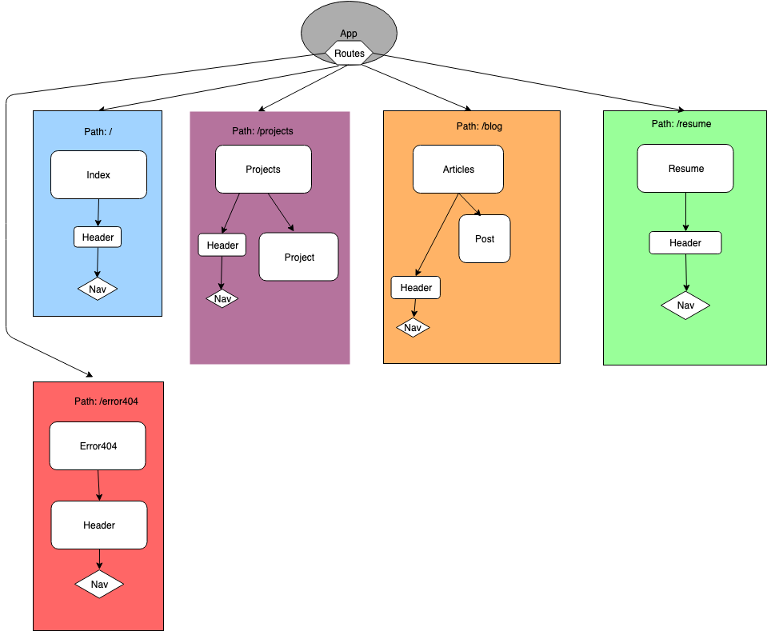

## Targets

### full mobile-first design
[FreeCode Camp Breakpoint Guide](https://medium.freecodecamp.org/the-100-correct-way-to-do-css-breakpoints-88d6a5ba1862)

#### potential breakpoints
- 320px (Current styling/layout is targeted for this breakpoint)
- 360px
- 375px
- 411px
- 414px
- 768px
- 1024px
- 1280px

### relational database
- sql
- blog entries
- resume data
- cover letters (with login set for addressee)
- users

### C# API
- persistent blog entries
- returns JSON

### user authentication
- admin log in
- user log in for blog comments

## Work log
**2/15/2019**
- 11:15 AM: updating component diagram to add Project.
- 2:45 PM: Researching mobile first design before the site gets complicated by too many styles.
- 3:00 PM: Still researching styling/layout ideas.
- 3:15 PM: Collecting images of projects to include on projects page.
- 3:30 PM: Collecting images of projects to include on projects page.
- 3:45 PM: Troubleshooting image display - issue with path?.
- 5:00 PM: Trying to figure out what steps to take next; reading Epicodus UI curriculum on box models.

**2/22/2019**
- 7:37 AM: researching how to build a ASP.NET Core WebAPI
[MicroSoft Dotnet API's](https://dotnet.microsoft.com/apps/aspnet/apis);
[MicroSoft Dotnet API tutorial](https://docs.microsoft.com/en-us/aspnet/core/tutorials/first-web-api?view=aspnetcore-2.2&tabs=visual-studio-code);
